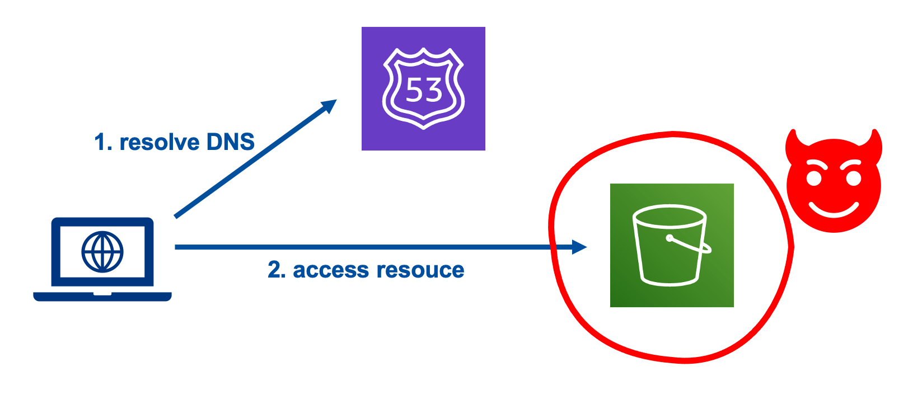

# S3-Takeover
### Minimal Python Script to Test S3 Bucket Takeovers

## Installation

```bash
$ pip3 install -r requirements.txt
```

You will also need to have your AWS credentials set up in order to connect to S3. 
```
$ aws configure 
AWS Access Key ID [****************VP2K]: something.....
AWS Secret Access Key [****************7CB5]: something.......
Default region name [us-west-2]: 
Default output format [json]: 
```
You can find more information on how to set up your AWS credentials in the boto3 documentation : 


[Boto3 Quick Start](https://boto3.amazonaws.com/v1/documentation/api/latest/guide/quickstart.html)

## Run
```bash
$ python3 s3-bucket.py your-bucket-name
```
